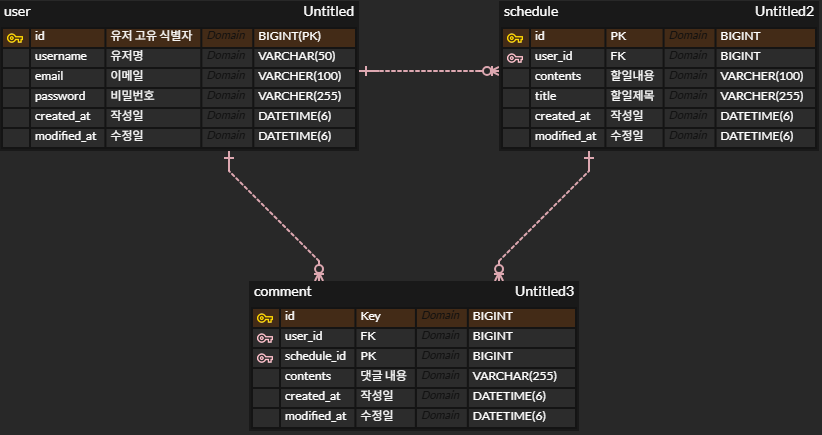

# 📅 일정 관리 앱 (Schedule App)

## 📌 프로젝트 소개
Spring Boot를 활용한 일정 관리 백엔드 애플리케이션입니다.
유저 관리, 일정 CRUD, 댓글 기능, Cookie/Session 기반 로그인 인증을 구현했습니다.

---

## 🛠 기술 스택
| 분류 | 기술 |
|------|------|
| Language | Java 17 |
| Framework | Spring Boot |
| ORM | Spring Data JPA |
| Database | MySQL |
| Security | BCrypt 암호화, Cookie/Session |
| Build Tool | Gradle |
| Tool | IntelliJ, Postman, Git |

---

## 📊 ERD
<!-- ERD 이미지를 여기에 추가해주세요 -->


---

## 📋 API 명세서

<details>
<summary>👤 유저 API</summary>

### 회원가입
| 항목 | 내용 |
|------|------|
| URL | `/users` |
| Method | `POST` |
| Status Code | `201 Created` |

**Request Body**
```json
{
    "username": "동엽",
    "email": "dongyeob@email.com",
    "password": "12345678"
}
```

**Response Body (성공)**
```json
{
    "id": 1,
    "username": "동엽",
    "email": "dongyeob@email.com",
    "createdAt": "2026-04-19T01:51:10",
    "modifiedAt": "2026-04-19T01:51:10"
}
```

**Response Body (실패)**
| 상태코드 | 메시지 | 설명 |
|---------|--------|------|
| `400` | `비밀번호는 8글자 이상이어야 합니다.` | 비밀번호 8글자 미만 |
| `400` | `이메일 형식이 올바르지 않습니다.` | 이메일 형식 오류 |
| `400` | `이름을 입력해주세요.` | username 빈값 |

---

### 유저 전체 조회
| 항목 | 내용 |
|------|------|
| URL | `/users` |
| Method | `GET` |
| Status Code | `200 OK` |

**Response Body (성공)**
```json
[
    {
        "id": 1,
        "username": "동엽",
        "email": "dongyeob@email.com",
        "createdAt": "2026-04-19T01:51:10",
        "modifiedAt": "2026-04-19T01:51:10"
    }
]
```

---

### 유저 단건 조회
| 항목 | 내용 |
|------|------|
| URL | `/users/{userId}` |
| Method | `GET` |
| Status Code | `200 OK` |

**Response Body (성공)**
```json
{
    "id": 1,
    "username": "동엽",
    "email": "dongyeob@email.com",
    "createdAt": "2026-04-19T01:51:10",
    "modifiedAt": "2026-04-19T01:51:10"
}
```

**Response Body (실패)**
| 상태코드 | 메시지 | 설명 |
|---------|--------|------|
| `404` | `없는 유저입니다.` | 존재하지 않는 유저 |

---

### 유저 수정
| 항목 | 내용 |
|------|------|
| URL | `/users/{userId}` |
| Method | `PATCH` |
| Status Code | `200 OK` |

**Request Body**
```json
{
    "username": "동엽수정",
    "password": "12345678"
}
```

**Response Body (성공)**
```json
{
    "id": 1,
    "username": "동엽수정",
    "email": "dongyeob@email.com",
    "createdAt": "2026-04-19T01:51:10",
    "modifiedAt": "2026-04-19T01:51:10"
}
```

**Response Body (실패)**
| 상태코드 | 메시지 | 설명 |
|---------|--------|------|
| `404` | `없는 유저입니다.` | 존재하지 않는 유저 |
| `401` | `비밀번호가 일치하지 않습니다.` | 비밀번호 불일치 |

---

### 유저 삭제
| 항목 | 내용 |
|------|------|
| URL | `/users/{userId}` |
| Method | `DELETE` |
| Status Code | `204 No Content` |

**Request Body**
```json
{
    "password": "12345678"
}
```

**Response Body (실패)**
| 상태코드 | 메시지 | 설명 |
|---------|--------|------|
| `404` | `없는 유저입니다.` | 존재하지 않는 유저 |
| `401` | `비밀번호가 일치하지 않습니다.` | 비밀번호 불일치 |

</details>

---

<details>
<summary>🔐 인증 API</summary>

### 로그인
| 항목 | 내용 |
|------|------|
| URL | `/auths` |
| Method | `POST` |
| Status Code | `200 OK` |

**Request Body**
```json
{
    "email": "dongyeob@email.com",
    "password": "12345678"
}
```

**Response Body (성공)**
```json
{
    "id": 1,
    "email": "dongyeob@email.com"
}
```

**Response Body (실패)**
| 상태코드 | 메시지 | 설명 |
|---------|--------|------|
| `404` | `존재하지 않는 유저입니다.` | 이메일 없음 |
| `401` | `비밀번호가 일치하지 않습니다.` | 비밀번호 불일치 |

---

### 로그아웃
| 항목 | 내용 |
|------|------|
| URL | `/auths/logout` |
| Method | `POST` |
| Status Code | `204 No Content` |

**Response Body (실패)**
| 상태코드 | 메시지 | 설명 |
|---------|--------|------|
| `400` | `Bad Request` | 로그인 상태가 아닌 경우 |

</details>

---

<details>
<summary>📅 일정 API</summary>

### 일정 생성
| 항목 | 내용 |
|------|------|
| URL | `/schedules` |
| Method | `POST` |
| Status Code | `201 Created` |

**Request Body**
```json
{
    "title": "할일 제목",
    "contents": "할일 내용",
    "userId": 1
}
```

**Response Body (성공)**
```json
{
    "id": 1,
    "title": "할일 제목",
    "contents": "할일 내용",
    "username": "동엽",
    "createdAt": "2026-04-19T01:51:10",
    "modifiedAt": "2026-04-19T01:51:10"
}
```

**Response Body (실패)**
| 상태코드 | 메시지 | 설명 |
|---------|--------|------|
| `404` | `존재하지 않는 유저입니다.` | 존재하지 않는 유저 |
| `400` | `제목을 입력해주세요.` | title 빈값 |
| `400` | `내용을 입력해주세요.` | contents 빈값 |

---

### 일정 전체 조회
| 항목 | 내용 |
|------|------|
| URL | `/schedules` |
| Method | `GET` |
| Status Code | `200 OK` |

**Response Body (성공)**
```json
[
    {
        "id": 1,
        "title": "할일 제목",
        "contents": "할일 내용",
        "username": "동엽",
        "createdAt": "2026-04-19T01:51:10",
        "modifiedAt": "2026-04-19T01:51:10"
    }
]
```

---

### 일정 단건 조회
| 항목 | 내용 |
|------|------|
| URL | `/schedules/{scheduleId}` |
| Method | `GET` |
| Status Code | `200 OK` |

**Response Body (성공)**
```json
{
    "id": 1,
    "title": "할일 제목",
    "contents": "할일 내용",
    "username": "동엽",
    "createdAt": "2026-04-19T01:51:10",
    "modifiedAt": "2026-04-19T01:51:10"
}
```

**Response Body (실패)**
| 상태코드 | 메시지 | 설명 |
|---------|--------|------|
| `404` | `없는 일정입니다.` | 존재하지 않는 일정 |

---

### 일정 수정
| 항목 | 내용 |
|------|------|
| URL | `/schedules/{scheduleId}` |
| Method | `PATCH` |
| Status Code | `200 OK` |

**Request Body**
```json
{
    "title": "수정된 제목",
    "contents": "수정된 내용",
    "userId": 1
}
```

**Response Body (성공)**
```json
{
    "id": 1,
    "title": "수정된 제목",
    "contents": "수정된 내용",
    "username": "동엽",
    "createdAt": "2026-04-19T01:51:10",
    "modifiedAt": "2026-04-19T01:51:10"
}
```

**Response Body (실패)**
| 상태코드 | 메시지 | 설명 |
|---------|--------|------|
| `404` | `없는 일정입니다.` | 존재하지 않는 일정 |
| `401` | `작성자만 수정할 수 있습니다.` | 작성자 불일치 |

---

### 일정 삭제
| 항목 | 내용 |
|------|------|
| URL | `/schedules/{scheduleId}` |
| Method | `DELETE` |
| Status Code | `204 No Content` |

**Request Body**
```json
{
    "userId": 1
}
```

**Response Body (실패)**
| 상태코드 | 메시지 | 설명 |
|---------|--------|------|
| `404` | `없는 일정입니다.` | 존재하지 않는 일정 |
| `401` | `작성자만 삭제할 수 있습니다.` | 작성자 불일치 |

---

### 일정 페이징 조회
| 항목 | 내용 |
|------|------|
| URL | `/schedules/page?page=0&size=10` |
| Method | `GET` |
| Status Code | `200 OK` |

**Response Body (성공)**
```json
{
    "content": [
        {
            "title": "할일 제목",
            "contents": "할일 내용",
            "commentCount": 1,
            "createdAt": "2026-04-19T01:51:10",
            "modifiedAt": "2026-04-19T01:51:10",
            "username": "동엽"
        }
    ],
    "totalElements": 1,
    "totalPages": 1,
    "size": 10,
    "number": 0
}
```

</details>

---

<details>
<summary>💬 댓글 API</summary>

### 댓글 생성
| 항목 | 내용 |
|------|------|
| URL | `/comments` |
| Method | `POST` |
| Status Code | `201 Created` |

**Request Body**
```json
{
    "contents": "댓글 내용",
    "userId": 1,
    "scheduleId": 1
}
```

**Response Body (성공)**
```json
{
    "id": 1,
    "contents": "댓글 내용",
    "userId": 1,
    "scheduleId": 1,
    "createdAt": "2026-04-19T01:51:10",
    "modifiedAt": "2026-04-19T01:51:10"
}
```

**Response Body (실패)**
| 상태코드 | 메시지 | 설명 |
|---------|--------|------|
| `404` | `존재하지 않는 유저입니다.` | 존재하지 않는 유저 |
| `404` | `존재하지 않는 일정입니다.` | 존재하지 않는 일정 |

---

### 댓글 전체 조회
| 항목 | 내용 |
|------|------|
| URL | `/comments` |
| Method | `GET` |
| Status Code | `200 OK` |

**Response Body (성공)**
```json
[
    {
        "id": 1,
        "contents": "댓글 내용",
        "userId": 1,
        "scheduleId": 1,
        "createdAt": "2026-04-19T01:51:10",
        "modifiedAt": "2026-04-19T01:51:10"
    }
]
```

</details>